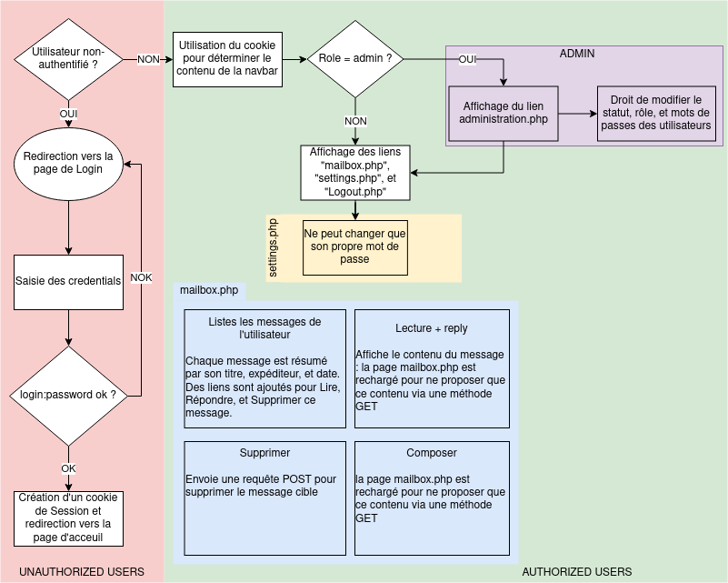
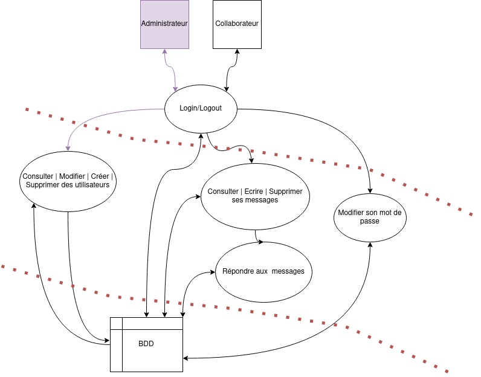
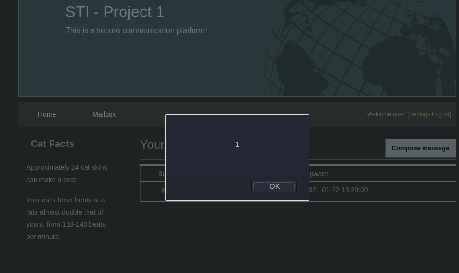

# STI Projet 2

### Rapport sur la sécurité de l'application de messagerie créée au projet 1

**Auteurs :** Mülhauser Florian ; Scherer Laurent

## Introduction

Ce projet à pour but de trouver et corriger les menaces existantes sur le projet 1 et à le modifier afin de palier à ces menaces. Aucune des fonctionnalités ne doivent être perdu.

Nous allons décrire le système existant afin de pouvoir mieux analyser les différentes sources de vulnérabilités et de menaces par la suite. Nous tenterons de créer des PoC et ou d'expliquer des scénarios reflétant ces dernières pour finalement les corriger.

## Schéma du fonctionnement de la WebApp et hypothèses de sécurité



### Data Flow Diagram



### Identifications des biens

Composition (ou éléments) du système :

* Application Web :
    * nginx/php
* Base de données (SQLite) :
    * Table rôles (role)
    * Table utilisateurs (users)
    * Table message (message)

Ces deux services communiquent l'un avec l'autre, on ne s'intéressara qu'au vulnérabilités introduites par le code php,
et non pas à celles introduites par les versions utilisées par ces services.

### Notion de rôle

Un utilisateur a un rôle associé lui donnant soit des droits en tant que *Collaborator* (`roleID 2`), soit en tant qu'*Administrator* (`roleID 1`).

#### Collaborator

Permet à un utilisateur défini comme *actif* de se connecter à l'application, lire ses message et en écrire.

#### Administrator

Permet à un utilisateur d'avoir toutes les fonctionnalités d'un *Collaborator* ainsi que les fonctionnalités
d'administration :

* ajout d'utilisateurs
* choix du rôle d'un utilisateur
* activation ou désactivation d'un utilisateur
* suppression d'un compte
* changement du mot de passe d'un utilisateur

### Périmètre de sécurisation

1. Page d'administration : Donne tout les droits sur tout les utilisateurs
2. Message des autres utilisateurs : Briserait la confidentialité du site
3. Modification ou suppression d'un message déjà envoyé : Problématique pour une bonne communication au sein de
   l'entreprise
4. Messages forgés : Il deviendrait trivial de nuire à une personne
5. Vol de login et mots de passe : Les mots de passes étant stockés en clair, une lecture de la DB dans ce but serait
   catastrophique

#### Données

Les données stockées sont les suivantes :

* Mots de passes et logins
* Messages

Il apparait évident que les aspects à protéger sont la **confidentialité** et l'**intégrité** ; un incident au niveau
des données résulterait en une peine pécuniaire pour manquement à la protection des données, ainsi qu'une perte de
crédibilité auprès des employés.

## Source des menaces

|Source|Motivation|Cible|Potentialité|
|:----:|:--------:|:---:|:----------:|
| Employés, utilisateurs mécontents ou curieux| Espionnage Industriel, Vengeance, Curiosité | Messages de tout les utilisateurs | Haute |
| Hackers + script-kiddies | Le défi, l'amusement | Tout | Moyenne |
| Concurrents | Espionnage Industriel | Messages stockés en DB / de tout les utilisateurs | Moyenne |
| Cybercriminels | Financière | Informations des utilisateurs (messages + mots de passe), spam + fishing | Moyenne |

### Vulnérabilités possibles

* SQLi
* XSS
* CSRF
* Versions des logiciels
* Contrôle d'accès défaillant (timing attacks possibles par exemple)

## Scénarios d'attaques

### Scénario 1) SQLi

Si une personne malveillante parvient à exécuter une injection SQL au niveau du formulaire de connexion, elle pourra alors commencer à obtenir des informations sur la DB et son contenu avec les requêtes SQL appropriées. L'impact sur l'entreprise serait très important, car cette attaque compromettrait l'intégralité des données présentes en base de
données. Un tel attaquant pourrait modifier et les lire les données afin de manipuler l'intégrité du service. Cela entrainerait une grande perte de crédibilité pour l'entreprise.

De part nos tests nous savons que des outils tels que SQLmap ne sont pas capables de créer des payloads afin d'obtenir des injections SQL, une telle attaque demandera donc des compétences plus avancées que celles d'un script-kiddy. Vecteur d'attaque plutôt réservé aux professionnels et cybercriminels.

#### Contre-mesures

* Validations de tout input utilisateur
* Renforcement des contrôles de l'accès

Nous n'avons pas réussi a trouver une SQLi fonctionnant avec nos PDO. Les mesures mises en places seront donc laissées.

### Scénario 2) XSS

Lors de l'écriture d'un message il est naturellement possible d'écrire du code JS. Ce code sera ensuite exécuté lorsque le destinataire ouvre le message. Il devient donc possible d'envoyer un message à un administrateur afin de lui voler son cookie de session : via un script on uploadera le cookie sur un site web distant où l'on récupèrera la valeur du cookie ; on peut ensuite enregistrer ce cookie localement et accéder au site en tant que cet administrateur.

Cette attaque étant très facile à mener, toute personne voulant nuire sera capable de l'exécuter. L'impact sur l'entreprise est là aussi une perte de la confidentialité et de l'intégrité des données.

#### Contre-mesures

Empêcher l'utilisation du char `<` ou `>` et les remplacer par des versions iso similaires mais ne fonctionnant pas comme des ouvertures et fermetures de balises. Par exemple `ᐸ` qui est le charactère iso 0x1438.

#### Exemple d'attaque et corrections apportées



On verra ici un exemple de la possibilité d'effectuer cette attaque.

Pour s'en prémunir on utilisera la fonction `str_replace()` dans notre classe [message.php](site/html/functions/message.php) afin de toujours supprimer le char `<`, on modifiera le code suivant :

```php
$this->object  = $ret['object'];
$this->content = $ret['message'];
```

en

```php
$this->object = str_replace("<","",$ret['object']);
$this->content = str_replace("<","",$ret['message']);
```

### Scénario 3) CSRF

Un utilisateur malveillant pourrait envoyer un email à l'un des autres utilisateur avec en contenu un lien malveillant, afin de faire effectuer à cet utilisateur une action sur le site contre son gré et à son insu.

L'impact sera similaire aux attaques précédente, mais ce type d'attaque ne requiert pas énormément de savoir. Il faudra juste savoir déguiser le lien que l'on faire cliquer ainsi que déterminer ce lien.

#### Contre-mesures

Création d'un token, au niveau de `header.php`:

```php
session_start();

if(empty($_SESSION['CSRFtoken'])){

	$_SESSION['CSRFtoken'] = bin2hex(openssl_random_pseudo_bytes(32));
}
$CSRFtoken = $_SESSION['CSRFtoken'];
```

Vérification du token au niveau du formulaire:

```php
if( !empty($_POST['CSRFtoken'])){

	if(hash_equals($_SESSION['CSRFtoken'],$_POST['CSRFtoken'] )){
		// c'est valide, on continue de traiter le formulaire
	} else {
		// on peut logger cela et juste arreter la le formulaire
	}
}
```


### Scénario 4) Contrôle d'accès défaillant

Un attaquant peut lire un message qui ne lui est pas destiné ou supprimer un message qui n'est pas présent dans sa boite mail, en modifiant le html avant d'exécuter la requête / cliquer sur le lien.

Il s'agit d'une attaque très simple à la porté de tous.

#### Contre-mesures

On voudra toujours vérifier que l'action est effectuée sur un message appartenant à la boite mail de l'utilisateur.

#### Exemple d'attaque et corrections apportées

Via l'url `/mailbox.php?read=true&messageID=XXX` on peut visionner et énumérer la totalité des messages dans la DB (en remplaçant les XXX par le chiffre/ID du message voulu). Il existe aussi la possibilité de supprimer un message qui n'est pas le notre, cette fois en modifiant le formulaire HTML de notre côté avant de cliquer sur *Supprimer*.

Pour corriger cette faille on ajoutera le code suivant dans les fichiers `mailbox.php` et `delete_msg.php` :

```php
// here we retrieve the messages sent to the user logged in
$sth = $db->prepare('SELECT s.username, m.recipientID, m.senderID, m.messageDate, m.object, m.messageID 
                     FROM message AS m 
                     INNER JOIN users AS s on s.id = m.senderID 
                     INNER JOIN users as u on u.id = m.recipientID 
                     WHERE u.username = ? 
                     ORDER BY messageDate DESC;');
$sth->execute(array($loginName));
$ret = $sth->fetchAll();
$isInMailbox = false;
foreach ($ret as $row)
{
	if ($row['messageID'] == $_GET['messageID'])
        {
        	$isInMailbox = true;
                break;
        }	
}
if ($isInMailbox == false)
{
	utils::redirect("mailbox.php");
}
```

Ce code permet simplement de vérifier que l'utilisateur interagit bien avec un message le concernant et non pas celui de quelqu'un d'autre.

### Scénario 5) Versions des logiciels

Il est très facile de regarder les failles découvertes pour les anciennes versions de logiciels, et de trouver des exploits associés fonctionnant "out of the box". Ce type d'attaque est ouverte à tous. Si des failles existent sans avoir une PoC ou un exploit disponible, les connaissances nécessaires pour cette attaque augmenteront en conséquence.

#### Contre-mesures

Garder les logiciels à jour.

### Scénario 6) Timing attacks

Au vu des fonctions utilisées lors du login, il est possible d'obtenir des informations à divers niveaux :

* Nom présent dans la DB
* Caractères composant le mot de passe

En effet, on vérifie d'abord de façon très simple si le nom est dans la DB, hors si un attaquant venait à mesurer le temps en ajoutant à chaque fois une lettre correcte, il pourrait énumérer les utilisateurs de DB. Puis on vérifie encore une fois de la même façon le mot de passe (simple string compare par PHP). Ce type d'attaque demande un minimum de connaissance technique mais peut éventuellement être à la porté de script-kiddies.

#### Contre-mesures

S'assurer qu'un login prenne toujours autant de temps, qu'il soit fait avec succès ou non. On pourra aussi introduire un élément de temps aléatoire, tel qu'un `sleep(rand(1,100) / 100);` avant notre requête SQL. C'est d'ailleurs la solution que l'on choisira. Cela introduira un temps d'attente allant de 0.01 à 1 seconde.

### Scénario 7) Mots de passe forts

En l'état le site web ne vérifie pas si un mot de passe est fort ou non, il n'y a pas de longueur minimale ou d' obligation d'utiliser caractères spéciaux + chiffres + lettres. Les mots de passes étant choisis par l'admin à la création il est probable qu'ils ne seront pas très complexe s'il doit les entrer lui même à chaque fois. De plus les utilisateurs mettront des mots de passes aussi simples que possible afin de s'en souvenir.

Une personne avec un peu d'imagination pourrait facilement deviner le mot de passe d'un collaborateur, le brute force serait aussi une possibilité.

#### Contre-mesures

Introduire une politique de mots de passe saine : 8 chars ou plus, utiliser au moins un chiffre, une lettre majuscule, et une lettre minuscule, ainsi qu'un caractère spécial.

On utilisera le code suivant pour forcer une politique de mot de passe saine :

```php
elseif (!preg_match('#^(?=.*[a-z])(?=.*[A-Z])(?=.*[0-9]).{8,}$#', $_POST['new_pwd']))
{
    echo "Password not strong enough. It must have a minimum length of 8, contain at least one lowercase letter, one uppercase letter and one number.";
}
```

Ce code sera appelé dans `settings.php` pour les utilisateurs changeant leur mot de passe, ainsi que
dans `administration.php` pour aussi forcer cette politique sur les admins


### Scénario 8) Login formulaire CSRF attaque

Un attaquant pourrait forcer un utilisateur à se connecter dans le compte de l'attaquant  sur son site web, et par ce biais révéler les informations de ce que le user fait quant il se connecte.

Les risques liés à cela pourrait être ici de voir tous les messages envoyés par cet utilisateur.

Vu qu'ici n'importe qui ne peut pas se faire un compte, le risque d'attaque est donc peu élevé car l'attaquant ne pourra pas vite créer un compte et ainsi connaitre ses identifiants. Il faudrait que ce soit une personne ayant un compte ici.


#### Contre-mesures:

Ajouter un CSRF Token dans le formulaire pour éviter cela:

Création d'un token, au niveau de `header.php`:

```php
session_start();

if(empty($_SESSION['CSRFtoken'])){

	$_SESSION['CSRFtoken'] = bin2hex(openssl_random_pseudo_bytes(32));
}
$CSRFtoken = $_SESSION['CSRFtoken'];
```

Vérification du token au niveau du formulaire:

```php
if( !empty($_POST['CSRFtoken'])){

	if(hash_equals($_SESSION['CSRFtoken'],$_POST['CSRFtoken'] )){
		// c'est valide, on continue de traiter le formulaire
	} else {
		// on peut logger cela et juste arreter la le formulaire
	}
}
```


###  

## Addendum

Il serait une bonne pratique de hasher et saler les mots de passes des utilisateurs, mais cela dépasse le cadre de ce projet où ne devions que nous occuper de la sécurité au niveau applicatif. Hors que le mot de passe soit hashé avant d'être sauvegarder en BDD ou non ne change rien aux risques et failles existant sur notre WebApp.
